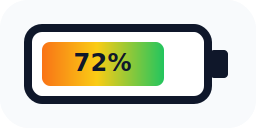

# Battery Level Card

A custom Lovelace card for Home Assistant that renders a device battery level as a visual battery indicator.



## Features

- Visual battery indicator with live fill level
- Automatic color transition from red (empty) to green (full)
- Optional percentage text inside the battery
- Built-in Lovelace visual editor support
- Horizontal or vertical battery layout
- Optional title shown beside or above the battery
- HACS compatible for simple installation

## Installation

### HACS (recommended)
1. Open HACS in Home Assistant.
2. Go to Frontend.
3. Open the menu in the top right and choose Custom repositories.
4. Add this repository with the category Lovelace.
5. Search for Battery Level Card and install it.
6. Restart Home Assistant.

### Manual
1. Copy `battery-level-card.js` to `config/www/community/battery-level-card/`.
2. Add the resource to your Lovelace dashboard resources under Settings -> Dashboards -> Resources:

```yaml
url: /local/community/battery-level-card/battery-level-card.js
type: module
```

3. Clear the browser cache if the card does not appear immediately.

## Configuration

### Visual editor
The card includes a built-in Lovelace configuration form, so you can configure it without writing YAML.

1. Open your dashboard.
2. Click Edit dashboard.
3. Add a new card.
4. Search for Battery Level Card.
5. Select the battery sensor entity you want to display.
6. Adjust the optional settings in the form.

The visual editor currently exposes these options:

| Field                  | Description                                                           |
| ---------------------- | --------------------------------------------------------------------- |
| `entity`               | Required. The battery sensor entity to display.                       |
| `name`                 | Optional custom title. Leave empty to use the entity's friendly name. |
| `show_name`            | Shows or hides the sensor name/title.                                 |
| `show_percentage_text` | Shows or hides the percentage text inside the battery.                |
| `orientation`          | Controls the battery direction: `horizontal` or `vertical`.           |
| `title_position`       | Places the title beside the battery (`side`) or above it (`top`).     |

Editor behavior notes:

- `orientation` changes the battery shape direction itself.
- `title_position` changes where the title is placed relative to the battery.
- If `show_name` is disabled, the card centers the battery visually.
- If the entity state is `unknown` or `unavailable`, the battery is shown as empty and dimmed.

### YAML configuration

```yaml
type: custom:battery-level-card
entity: sensor.phone_battery_level
name: Phone Battery
show_percentage_text: true
show_name: true
orientation: horizontal
title_position: side
```

### Configuration options

| Option                 | Type    | Default              | Description                                     |
| ---------------------- | ------- | -------------------- | ----------------------------------------------- |
| `entity`               | string  | required             | The entity ID of the battery sensor             |
| `name`                 | string  | entity friendly name | Custom display title                            |
| `show_percentage_text` | boolean | `true`               | Shows the percentage inside the battery         |
| `show_name`            | boolean | `true`               | Shows or hides the sensor title                 |
| `orientation`          | string  | `horizontal`         | Battery orientation: `horizontal` or `vertical` |
| `title_position`       | string  | `side`               | Places the title at the side or at the top      |

## Examples

### Basic usage

```yaml
type: custom:battery-level-card
entity: sensor.smartphone_battery
```

### With a custom title

```yaml
type: custom:battery-level-card
entity: sensor.tablet_battery_level
name: iPad Battery
```

### Without percentage text inside the battery

```yaml
type: custom:battery-level-card
entity: sensor.remote_battery
name: Remote Control
show_percentage_text: false
```

### Vertical layout with the title above the battery

```yaml
type: custom:battery-level-card
entity: sensor.window_sensor_battery
name: Window Sensor
orientation: vertical
title_position: top
```

### Without a title

```yaml
type: custom:battery-level-card
entity: sensor.mouse_battery
show_name: false
```

## Color scheme

The battery fill color changes automatically based on the charge level:

| Range   | Color                 |
| ------- | --------------------- |
| 0-25%   | Red -> Orange         |
| 25-50%  | Orange -> Yellow      |
| 50-75%  | Yellow -> Light Green |
| 75-100% | Light Green -> Green  |

## Development and local testing

In short: the project provides a local Home Assistant instance through `docker compose` plus a preconfigured Lovelace resource. Your working copy is mounted into the Home Assistant container `www` directory, so changes to `battery-level-card.js` are available immediately.

- Requirements: Docker with Docker Compose and optionally VS Code or a Dev Container.
- Start from the project root:

```bash
docker compose up -d
```

- Open: http://localhost:8123 or use the VS Code task `Home Assistant: Open`.

- Dev Container: open the repository in a Dev Container. Port 8123 is forwarded. Inside the container you can run `docker compose up -d` because the `docker-outside-of-docker` feature is configured.

### How the card reaches the test system

- The Compose volume mounts the repository root to `/config/www/community/battery-level-card` inside Home Assistant.
- That means `battery-level-card.js` is available in the container at `/config/www/community/battery-level-card/battery-level-card.js`.
- Saving changes in your working copy is usually enough. A container restart is normally not required.

### Cache and live reload

- Disable browser cache in DevTools and reload the page with Ctrl+F5.
- Alternatively, add a version query string to the resource URL, for example `/local/community/battery-level-card/battery-level-card.js?v=20260318`.

### Check and debug

Show Home Assistant logs:

```bash
docker compose logs -f homeassistant
```

Check the file inside the container:

```bash
docker exec -it battery-level-card-homeassistant ls -l /config/www/community/battery-level-card
docker exec -it battery-level-card-homeassistant cat /config/www/community/battery-level-card/battery-level-card.js | sed -n '1,40p'
```

Restart the container if needed:

```bash
docker compose restart homeassistant
```

### Recommended workflow

1. Open the project in VS Code, optionally in a Dev Container.
2. Run `docker compose up -d`.
3. Edit `battery-level-card.js` and save it.
4. In the browser, disable cache and do a hard reload, or bump the `?v=` query parameter.

### Troubleshooting

- Check `ha-config/configuration.yaml` and make sure the resource `/local/community/battery-level-card/battery-level-card.js` is configured.
- If you see module import errors, inspect the browser console.
- If changes are not visible, the issue is usually browser cache or an unchanged query parameter.

## VS Code tasks

The repository includes VS Code tasks for common local actions. You can run them from Terminal -> Run Task.

- `Home Assistant: Start / Stop / Restart / Logs / Open` to control the local container or open the UI.
- `Git: Add All` runs `git add -A` in the repository.
- `Git: Commit (auto)` creates an automatic short commit message in the form `dev: update<timestamp>` if there are changes.
- `Git: Push` pushes the current branch.
- `Git: Commit & Push` combines add, commit, and push.

These tasks work the same way inside the Dev Container because `docker-outside-of-docker` is configured.

## Repository icon

An SVG icon matching the battery look of the card is included at `docs/icon.svg`. You can reuse it for documentation, releases, or repository presentation.

## License

Released under the MIT License. See `LICENSE` for details.
